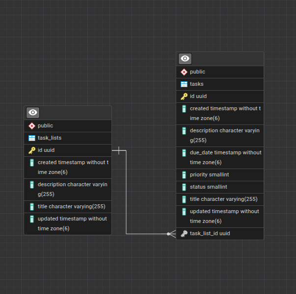
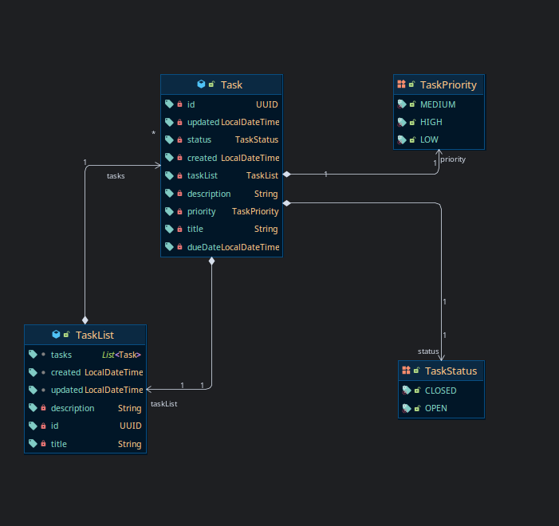

# Task Tracker App

## 1. Introduction
Task tracker app with simple CRUD.

## 2. Role
Backend developer implements controllers, services and datasource management, handle api response for the front end web app

## 3. Tech
- Spring Boot
- React
- Vite
- JPA / Hibernate
- Swagger (OpenAPI)
- PostgreSQL
- H2 (for testing)

## 4. ERD

## 5. Entity Diagram

## 6. Endpoints
Task lists:
- GET /api/task-lists — list task lists
- GET /api/task-lists/{task_list_id} — get single task list
- POST /api/task-lists — create task list
- PUT /api/task-lists/{task_list_id} — update task list
- DELETE /api/task-lists/{task_list_id} — delete task list

Tasks:
- GET /api/task-lists/{task_list_id}/tasks — list tasks
- GET /api/task-lists/{task_list_id}/tasks/{task_id} — get single task
- POST /api/task-lists/{task_list_id}/tasks — create task
- PUT /api/task-lists/{task_list_id}/tasks/{task_id} — update task
- DELETE /api/task-lists/{task_list_id}/tasks/{task_id} — delete task

